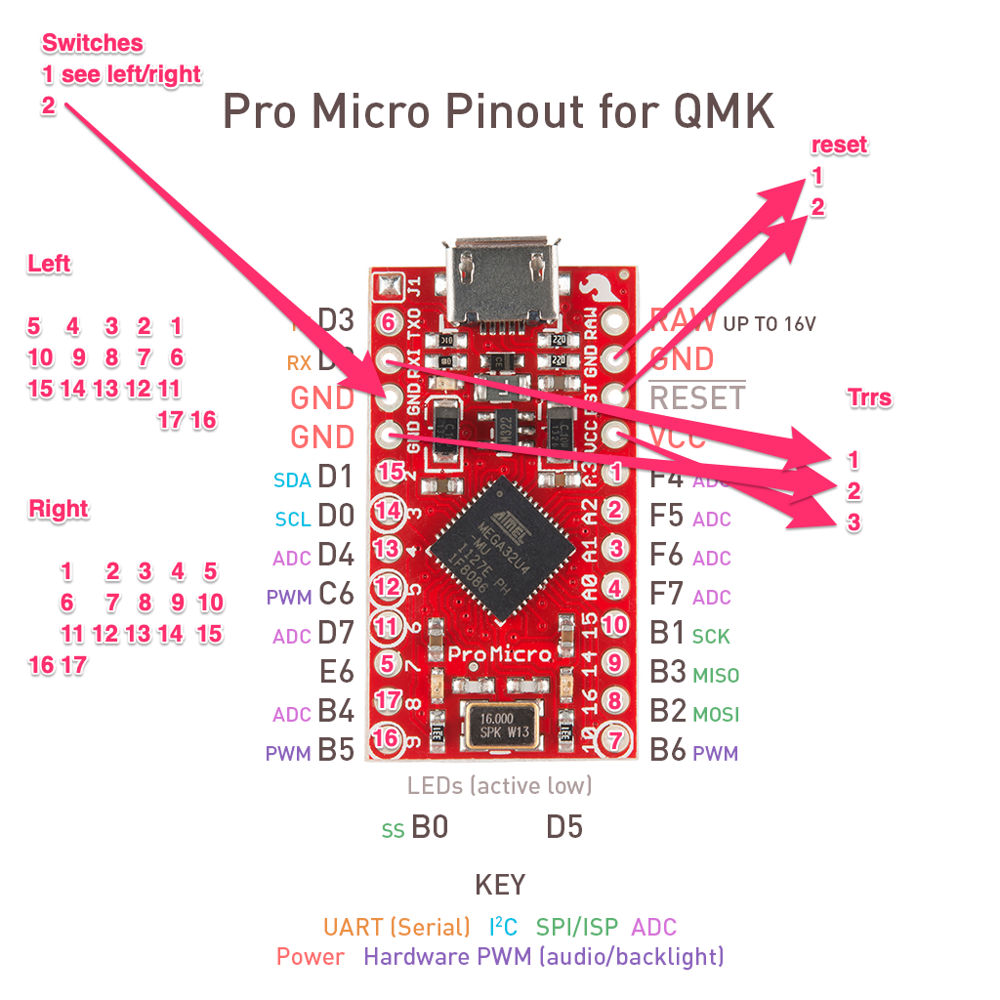

# The Chortyl

This is a 34 key split dactyl inspired keyboard. I designed the case from scratch in fusion 360 based on [Quentin from bastardkb.com’s YouTube videos](https://www.youtube.com/watch?v=scoX8NZv4MI).

I copied the switch positions from an earlier build that used the [dometyl keyboard generator](https://github.com/geoffder/dometyl-keyboard), specifically [the dartyl](https://github.com/geoffder/dometyl-keyboard/tree/main/things/boards/dartyl_mx). The thumb key positioning is based on the [OG dactyl](https://github.com/adereth/dactyl-keyboard), as manuform style thumb clusters don’t agree with my RSI.

Other inspiriation:
* [The skeletyl](https://bastardkb.com/product/skeletyl-diy-kit-with-case-and-electronics/) - open can be pretty
* [The niztyl](https://github.com/geoffder/dometyl-keyboard/tree/main/things/boards/niztyl) - the basis for the curvature of the columns
* [Lil Chonky Bois](https://github.com/sanderboer/chonkybois) - a much prettier predecessor
* [Hypergolic](https://github.com/davidphilipbarr/hypergolic) - a split 34 key keyboard with pinky splay
* [Pseudo Make Me Key Cap Profile](https://github.com/pseudoku/PseudoMakeMeKeyCapProfiles) - convex 1u keycaps

## BOM

* Left/right [cases](chortyl.stl) printed
* Left/right [promicro holders](promicro-holder-usb-c.stl) printed
* 2x [TRRS jacks](https://www.aliexpress.com/item/1005001928651798.html)
* 2x [USB-c/Micro-USB Pro Micros](https://www.aliexpress.com/item/32887074671.html)
* 1x TRRS cable
* 1x USB cable
* 34x MX switches
* 34x 1u pcbs. I used [MxLEDBitPCB Altana](https://github.com/swanmatch/MxLEDBitPCB/tree/master/altana) manufactured by jlc. The altana requires [hotswap sockets](https://www.aliexpress.com/item/4001051840976.html). Amoeba's are good too. These are optional as soldering directly to switch pins is possible.
* For friction I use little peices of "[nano tape](https://www.aliexpress.com/item/1005001598557779.html)"
* Keycaps - I like mt3 keycaps from drop.com
* 4x Convex keycaps for thumb keys - you can print [pseudoku](https://github.com/pseudoku/PseudoMakeMeKeyCapProfiles)'s designs or [buy them](https://www.asymplex.xyz/).
* 2x [6x6 switches](https://www.aliexpress.com/item/4000864332254.html) for reset buttons
  
## Wiring

You can do this however you want, but I usually wire the same as the ferris sweep and use QMK in direct pins mode.

